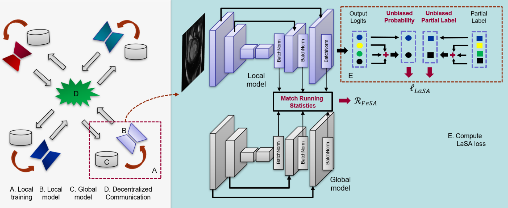

# A New Framework of Swarm Learning Consolidating Knowledge from Multi-Center Non-IID Data for Medical Image Segmentation
This project is developed for the TMI paper: [A New Framework of Swarm Learning Consolidating Knowledge from Multi-Center Non-IID Data for Medical Image Segmentation](https://ieeexplore.ieee.org/document/9943283). In this paper, we proposed LaSA and FeSA loss to deal with the Non-IID challenge in distributed learning for partially supervised image segmentation. For more information, please read the following paper:

<div align=center></div>

```
@ARTICLE{9943283,
  author={Gao, Zheyao and Wu, Fuping and Gao, Weiguo and Zhuang, Xiahai},
  journal={IEEE Transactions on Medical Imaging}, 
  title={A New Framework of Swarm Learning Consolidating Knowledge from Multi-Center Non-IID Data for Medical Image Segmentation}, 
  year={2022},
  volume={},
  number={},
  pages={1-1},
  doi={10.1109/TMI.2022.3220750}}
```

# Usage
```
python main.py --mode non-iid --weight 0.1
```

If you have any problems, please feel free to contact us. Thanks for your attention.
